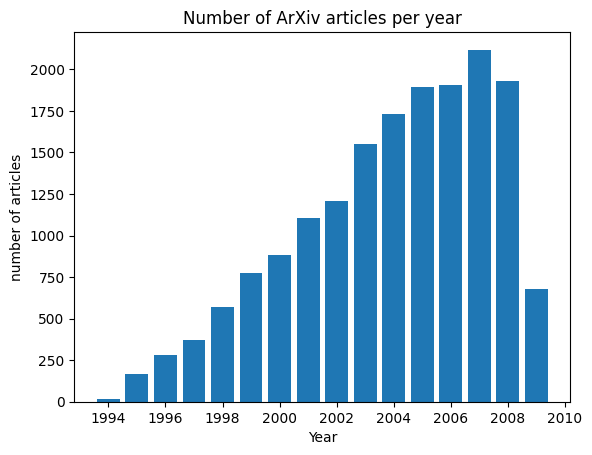
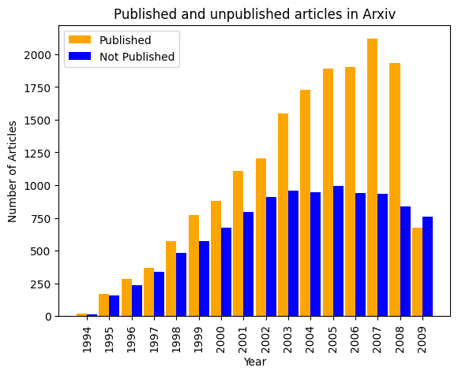

# ArXiv-articles-on-Quantum-mechanics
This repository contains information about the number of ArXiv articles published in the field of Quantum Mechanics. The dataset includes counts of articles published over a specific time period, providing insights into the research activity and trends within this domain. The data is collected from Kaggle.

Dataset Description:
--------------------------------------
The dataset consists of counts of ArXiv articles related to Quantum Mechanics. The counts are organized based on different time periods, such as years. Each data point represents the number of articles published within a particular time period. The dataset can be used to analyze the growth of research activity, identify patterns, and gain a better understanding of the Quantum Mechanics research landscape.

**Importance of articles on quantum mechanics:**

1. **Advancing Scientific Knowledge**: Quantum mechanics is a fundamental theory in physics that describes the behavior of particles at the atomic and subatomic levels. Articles on quantum mechanics contribute to the ongoing advancement of scientific knowledge and our understanding of the fundamental principles governing the microscopic world. They explore and uncover the intricacies of quantum phenomena, such as superposition, entanglement, and wave-particle duality.

2. **Driving Technological Innovations**: Quantum mechanics has paved the way for significant technological advancements. Articles on quantum mechanics highlight the latest research, discoveries, and developments in quantum computing, quantum cryptography, quantum sensing, and other quantum technologies. These articles provide insights into cutting-edge applications and help shape the future of technology.

3. **Deepening Understanding of Nature**: Quantum mechanics challenges our classical intuition and reveals the bizarre and fascinating nature of the quantum realm. Articles on quantum mechanics explore the counterintuitive aspects of quantum phenomena and help us develop a deeper understanding of the fundamental nature of reality. They shed light on the non-locality, uncertainty, and probabilistic nature of quantum systems, leading to philosophical and conceptual discussions.

4. **Informing Scientific Community**: Articles on quantum mechanics serve as a means of communication within the scientific community. They enable researchers, scientists, and academics to share their findings, theories, and experimental results with their peers. These articles contribute to the collective knowledge and understanding of the field, facilitating collaborations and inspiring new research directions.

5. **Educating and Inspiring Future Scientists**: Articles on quantum mechanics play a crucial role in educating and inspiring the next generation of scientists and researchers. They provide learning resources, explanations of complex concepts, and real-world applications of quantum mechanics. These articles help nurture scientific curiosity, ignite passion, and motivate students to pursue careers in physics, quantum computing, and related fields.

Overall, articles on quantum mechanics are essential for the progress of science, technological innovation, deepening our understanding of nature, facilitating scientific communication, and inspiring future generations. They contribute to the ongoing exploration and appreciation of the fascinating and ever-evolving field of quantum mechanics.

The [Fig.1](graph1.png) represents the number of articles published between the years 1994 and 2009. It is evident that the contributions in the field of quantum mechanics have been deliberately increasing, reaching their highest point in 2007. This trend indicates a growing interest in the richness of quantum mechanics and its advancements. Another noteworthy observation pertains to the comparison between articles published in scientific journals and those remaining in the ArXiv repository. [Fig.2](graph2.png) illustrates the number of articles uploaded to ArXiv versus the number of articles that were published. The results indicate a positive trend, as more articles were published compared to those remaining as ArXiv files. However, the graph shows a decline in 2009, which warrants further investigation.

ArXiv articles on Quantum Mechanics drive scientific progress, and technological innovation, and deepen our understanding of the quantum world. They facilitate knowledge sharing, inspire collaboration, and ignite curiosity among researchers worldwide. By studying trends and patterns within these articles, we uncover new possibilities and push the boundaries of human understanding in this fascinating field.

Acknowledgments:
--------------------------------------
I would like to express my gratitude to the Kaggle server for providing access to the metadata.
